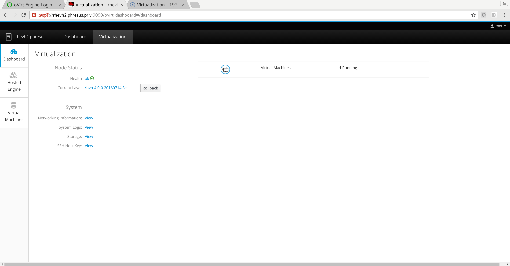
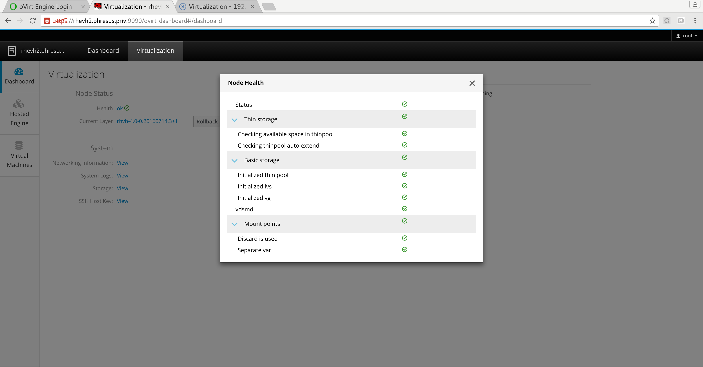
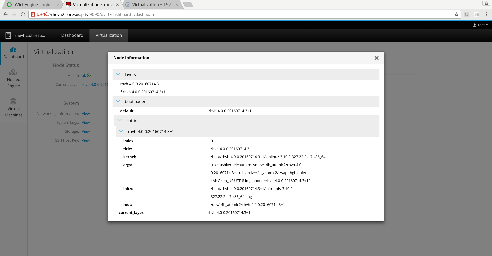
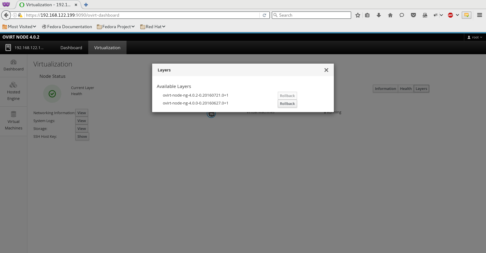
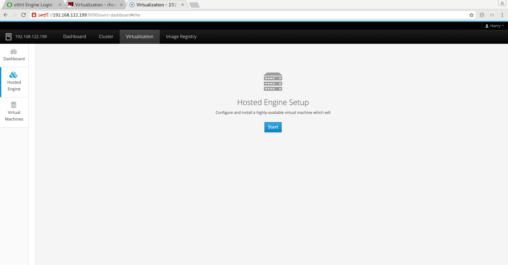
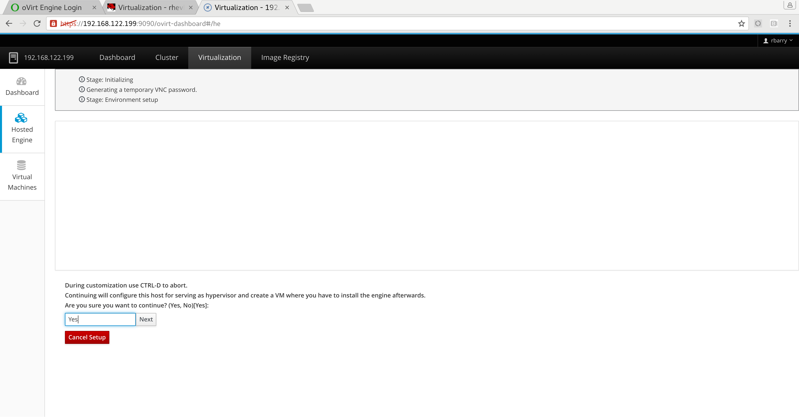

# Administration

## Overview

**FIXME**

-   Cockpit is used for administration

-   All non\-oVirt specific bits go to their reflective upstream

-   cockpit-ovirt-dashboard provides oVirt-specific functionality under the
"Virtualization" tab. The dashboard is capable of showing the health of the
running node, information about layers, and manages switching between layers.

## Cockpit

[The Cockpit project](http://www.cockpit-project.org) is building a web-based
UI to administer a host.

Cockpit provides a large range of functionality, and many aspects of the system
can be configured from your web browser.

Cockpit can be used to configure networking before registering to the Engine or
deploying Hosted Engine. Additionally, Cockpit can change the hostname,
configure tuned profiles, view hardware information, view system logs, manage
services, and even open a terminal on the system!

Visit the [Cockpit](http://www.cockpit-project.org) site to learn more, as new
functionality is added frequently, or simply browse around the interface, which
can be reached at port _9090_ on Node.

## oVirt Dashboard

oVirt Node includes `cockpit-ovirt-dashboard`, which provides a functional
interface to information and features which are not available in upstream
Cockpit.

The oVirt dashboard can be used to monitor the health and status of oVirt Node,
install oVirt Hosted Engine, and manage oVirt Hosted Engine once installed.

Provided information includes:

-   The health of the running Node. This is also available by using a shell on
the node and running `nodectl check`. Some checks are performed, and an overall
status is reported which aggregates the result of checking services, ensuring
that the correct LVM layout is used, and ensuring that filesystems are mounted
with the correct options.

-   Information about installed layers and their layout.

-   The layer which is currently booted

-   Bootloader information and arguments

-   If more than one layer is installed, the oVirt Dashboard provides a way to
easily change between layers.

## Hosted Engine (Cockpit)

`cockpit-ovirt-dashboard` provides a convenient interface to
`ovirt-hosted-engine-setup`, which can be run completely from Cockpit.

All that's needed is to click the `Start` button and follow along. Fields which
have a suggested default will be automatically filled.

Note that shared storage (iSCSI, Fibre Channel, NFS, or Gluster) is required
for Hosted Engine.

Once completed, you'll be presented with an interface to Hosted Engine, from
which you can monitor the status of the cluster, put the cluster into global
maintenance, remove the cluster from global maintenance, and put the host you're
logged into into local maintenance.

## Upgrading

Updating to a new version of Node is a simple `yum update`

## nodectl

If you choose to use a shell to manage oVirt Node, `nodectl` provides an
interface to the core Node functionality which is accessible from Cockpit.

`nodectl check` will provide the health of the system.

`nodectl info` will provide information about layers and the bootloader.

`nodectl rollback` allows you to easily swap between versions of Node.
