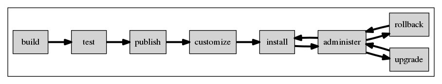

# Design

## Principles

A few principles provide the framework for the upcoming design decisions:

* Re-use existing, mature technologies (anaconda, lvm, cockpit)
* Fix upstream to fit our design
* Keep it simple
* Separate areas of responsibility (image vs installation vs image management
  & upgrade)

## Life-cycle Overview

Before diving into the technical details, let us get overview over how the life
of an image is envisioned. Once we are aware of this, we can see what
components[^1] can be used to fill these situtations.

[^1] When speaking of components, it is referring to another software project.

As seen in the diagram above, and image is built, tested, and published. These
actions are normally performed by a vendor or project, who provides the image.

The image is **built** from a set of packages, normally consisting of a core
set of packages for the operating system, and a couple of packages to provide
the payload (in the oVirt case, vdsm is the payload).

The **testing** performs some sanity tests, e.g.

- Ensure that the image is not corrupted,
- Ensure that essential packages are installed,
- But they can also cover basic functional testing.

Once the image is good, it is **published** for further user consumption.

The remaining steps are then performed by users.

If a user needs extra packages inside the image, it can be **customized**
before installation.

Once he is satisfied, the image is **installed** onto a host, and is ready to
use.

At runtime the image is **administrated** through a user-friendly UI.

Eventually **upgrades** become available and are installed. These upgrades
either end up successful, or they fail. In case of a failure, the **rollback**
mechanism is used to roll back to the state prior to the upgrade, in order to
return to a functioning system.

## Core technologies & concepts

In the light of the principles, the following (mainly) extant technologies
`were chosen to realize the flows above:

* Build: livemedia-creator (or koji)
* Delivery format: liveimg-compatible squashfs
* Customization: guestfish
* Installation: anaconda
* Upgrade & Rollback: imgbased and LVM
* Administration: Cockpit

The file-system layout and related concepts are not a technology, but are
crucial for data persistence and the stability of upgrades and rollbacks.
The layout and concept is aligned to what other projects, such as
[OSTree](https://github.com/GNOME/ostree) and
["Project Stateless"](http://0pointer.net/blog/projects/stateless.html), aim
for.

## Detailed Flow

Now that we are aware of the components which come together to form Node, the
following diagram illustrates in what flows they are used:

You may notice that the diagram contains a few previously unnamed components.
No worries, we'll speak about them later on.

By now, we assume that you got an idea of how the life cycle of a Node looks,
and what components are used in the specific flows.
